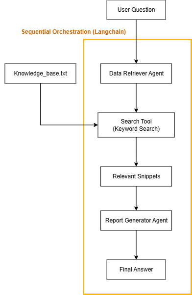

# Bangkok Bank Innovation Data and AI Fest 2026 Test : Multi Agentic RAG

<div class="display: flex; justify-content: center;">
  
</div>

## Project Overview

This project is a sequential Multi-Agent Retrieval-Augmented Generation (RAG) system built with LangChain using **GPT5-mini** as the LLM for the agents.

The system consists of two agents:
- Data Retriever Agent : Searches the knowledge base and retrieves relevant information.
- Report Generator Agent : Combines the retrieved information into a clear and easy-to-understand answer.

---

## Project Structure

```
multi-agentic-rag/
├── README.md                         # Project documentation and usage instructions
├── requirements.txt                  # Python dependencies
├── knowledge_base.txt                # Local product knowledge base
├── .env.example                      # Example environment variables
├── .gitignore                        # Files excluded from Git
└── src/
    ├── __init__.py                   # Python package initialization
    ├── main.py                       # Sequential multi-agent orchestration
    ├── llm.py                        # LLM configuration and initialization
    ├── retriever.py                  # Text chunking and keyword retrieval logic
    ├── data_retriever_agent.py       # Agent for retrieving relevant snippets
    └── report_generator_agent.py     # Agent for generating the final answer
```

---

## Workflow
<div align="center">
  
</div>

How the System Works
```
The system processes each question in the following order:

1. The user sends a question through main.py.
2. LangChain passes the question to the Data Retriever Agent.
3. The Data Retriever Agent calls the search tool once. The tool loads knowledge_base.txt, splits the content into chunks, and searches for matching keywords.
4. The search tool returns the top three relevant chunks. These chunks are passed back as retrieved context without being rewritten or summarized.
5. The Report Generator Agent receives the original question and the retrieved context. It uses only this context to create a clear final answer.
6. If no relevant information is found, the Report Generator Agent tells the user that the knowledge base does not contain the requested information instead of making up an answer.
7. main.py returns the final answer to the user.
```
---

## How to run

### 1. Clone the Repository

```bash
git clone https://github.com/DrKitti/multi-agentic-rag.git
cd multi-agentic-rag
```

### 2. Set Up Python Virtual Environment

**Windows (Command Prompt):**
```cmd
python -m venv .venv
.venv\Scripts\activate.bat
```

**Windows (PowerShell):**
```powershell
python -m venv .venv
.venv\Scripts\Activate.ps1
```

**macOS/Linux:**
```bash
python3.11 -m venv .venv
source .venv/bin/activate
```

### 3. Install Dependencies

```bash
pip install -r requirements.txt
```
Install all packages that needed for this project.

### 4. Configure environment variables

```env
TYPHOON_API_KEY=your_api_key_here
TYPHOON_BASE_URL=https://api.opentyphoon.ai/v1
TYPHOON_MODEL=typhoon-v2.5-30b-a3b-instruct
```

Setup API for LLM Calling.

### 5. Run Script

**Windows:**
```cmd
python src\main.py "Which computer is best for students?"
```

**macOS/Linux:**
```bash
python3 src/main.py "Which computer is best for students?"
```

Or you can run **retriever.py** instead of main.py for testing retrieval only.

---

## Result
